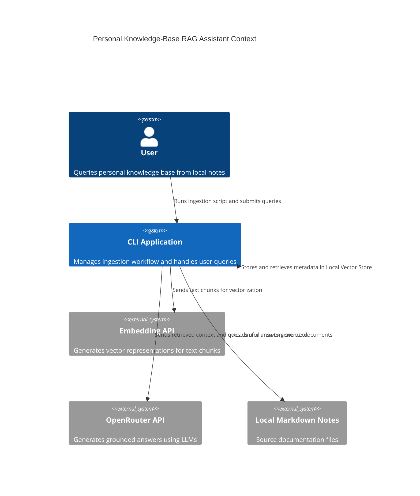

<!-- Diagram source for adr_0001, generated by Architect (Gemma). Rendered inline on GitLab via its native Mermaid support. -->

```mermaid
C4Context
    title Personal Knowledge-Base RAG Assistant Context
    Person(user, "User", "Queries personal knowledge base from local notes")
    System(cli, "CLI Application", "Manages ingestion workflow and handles user queries")
    System_Ext(embedding_api, "Embedding API", "Generates vector representations for text chunks")
    System_Ext(openrouter, "OpenRouter API", "Generates grounded answers using LLMs")
    System_Ext(markdown_notes, "Local Markdown Notes", "Source documentation files")
    Rel(user, cli, "Runs ingestion script and submits queries")
    Rel(cli, markdown_notes, "Reads and monitors source documents")
    Rel(cli, embedding_api, "Sends text chunks for vectorization")
    Rel(cli, openrouter, "Sends retrieved context and question for answer generation")
    Rel(cli, cli, "Stores and retrieves metadata in Local Vector Store")
```
