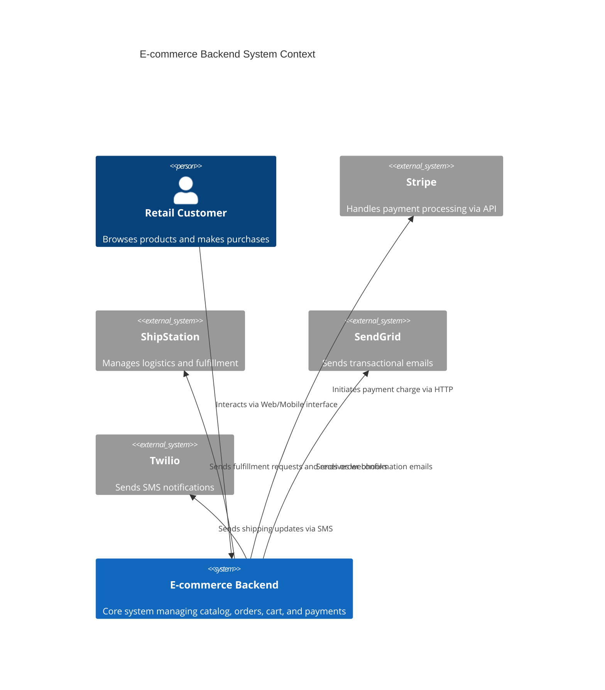

# Review — workflow `b1d55d1a-92b6-4251-a95c-10a1326dce07`

## Researcher

**Services identified:** ECS, RDS, Redis, Elasticsearch

**Pricing:**

| Service | Provider | Monthly USD | Notes |
|---|---|---|---|
| ECS | aws | 10.0 | stub estimate, MVP scoping per spec §8 |
| RDS | aws | 45.0 | stub estimate, MVP scoping per spec §8 |
| Redis | aws | 10.0 | stub estimate, MVP scoping per spec §8 |
| Elasticsearch | aws | 10.0 | stub estimate, MVP scoping per spec §8 |

**Summary:**

The architecture relies on several core AWS services: ECS for container orchestration, RDS for relational data (PostgreSQL), Redis for caching, and Elasticsearch for search. Initial cost estimates suggest a baseline monthly infrastructure cost of approximately $85 USD, based on stub estimates for the MVP scope.

The pricing context is heavily influenced by the chosen service tiers and the expected load, especially given the requirement to handle 10x traffic spikes. RDS costs will scale with instance size and I/O operations. ECS costs depend on the number of running tasks and the underlying compute resources. Redis and Elasticsearch costs are generally predictable based on instance size. The current estimates are preliminary and require detailed sizing to account for production traffic and high availability needs.

*[thermal guard: 57.0°C, waited 3.0s]*

## Architect

**Model:** gemma  
**Informed by prior ADRs:** adr_0001

**Docs:**

The E-commerce Backend system acts as the central platform for the retail business. It interacts with external services such as Stripe for payments, ShipStation for logistics, and SendGrid/Twilio for customer notifications. The system supports retail customers through its frontend interfaces, manages internal operations, and maintains data integrity across its various internal microservices.

**Diagram source (Mermaid C4Context):**

**Components (6):**

| id | name | type | redundant |
|---|---|---|---|
| customer | Retail Customer | person | False |
| ecommerce_backend | E-commerce Backend | internal_system | False |
| stripe | Stripe | external_system | False |
| shipstation | ShipStation | external_system | False |
| sendgrid | SendGrid | external_system | False |
| twilio | Twilio | external_system | False |

*[thermal guard: 56.0°C, waited 3.0s]*

## Scribe (ADR draft)

**Context:** L1 System Context

**Decision:** Centralize product data in a single source of truth service rather than duplicated across Catalog, Search, and Order services.

**Consequences:** This change simplifies data management and ensures consistency across services. However, it may introduce a single point of failure and increase complexity in the system. The team will need to implement robust failover mechanisms and ensure that the new service is properly integrated with existing systems.

**Diff summary:** The product data is currently duplicated across Catalog, Search, and Order services. Centralizing it in a single source of truth service would improve data consistency and simplify management. However, this change requires careful planning to ensure that the new service can handle the increased load and complexity.

**Affected diagrams:** context

*[thermal guard: 55.0°C, waited 3.0s]*

## Critic (devil's advocate)

**gaps** (3):
- {'description': 'The diagram does not show any data storage or caching layer, which is essential for handling high read loads on inventory lookups.', 'severity': 'medium', 'related_component': 'OrderService'}
- {'description': "The Rel lines between components are not explicitly labeled as 'Rel to' or 'Rel from', which could lead to ambiguity about the direction of data flow.", 'severity': 'low', 'related_component': 'All components'}
- {'description': 'The diagram does not show any monitoring or alerting mechanisms, which are crucial for maintaining system health and detecting failures.', 'severity': 'medium', 'related_component': 'All components'}

**spofs** (1):
- OrderService is a single instance handling both critical paths with no stated redundancy.

**missing_integrations** (1):
- No integration shown between ecommerce_backend and shipstation for order fulfillment updates.

*[thermal guard: 54.0°C, waited 3.0s]*

## Judge

**Recommendation:** `revise`  
**Flagged for review:** spof_count, redundancy_ratio, cost_per_component

| Metric | Value | Target | Flag threshold | Direction | Flagged | Reason |
|---|---|---|---|---|---|---|
| spof_count | 1.0 | 0.0 | 1.0 | lower_is_better | True | Any SPOF flags for human review |
| redundancy_ratio | 0.0 | 0.8 | 0.5 | higher_is_better | True | Rough placeholder threshold, not yet system-type aware. Below 0.5 flags for human review, see Known Limitations Metric Context Blindness |
| cost_per_component | 12.5 | 1.0 | 5.0 | lower_is_better | True | Rough placeholder dollar figure, not yet system-type aware. Above 5 flags for human review, see Known Limitations Metric Context Blindness |
| integration_coverage | 0.8 | 1.0 | 0.8 | higher_is_better | False |  |
| adrs_per_diff | 1.0 | 1.0 | 1.0 | higher_is_better | False |  |

**Cost estimate:** $75.0

---

Approve: `python pipeline/send_approval.py b1d55d1a-92b6-4251-a95c-10a1326dce07`  
Reject:  `python pipeline/send_approval.py b1d55d1a-92b6-4251-a95c-10a1326dce07 --reject "notes"`
