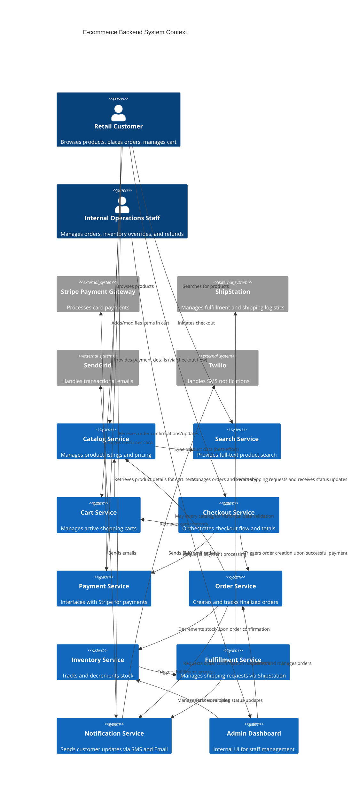

# Review — workflow `d86d5467-ff52-4fc7-9efe-a5d5e150206d`

## Researcher

**Services identified:** ECS, RDS, ElastiCache, Elasticsearch

**Pricing:**

| Service | Provider | Monthly USD | Notes |
|---|---|---|---|
| ECS | aws | 10.0 | stub estimate, MVP scoping per spec §8 |
| RDS | aws | 45.0 | stub estimate, MVP scoping per spec §8 |
| ElastiCache | aws | 10.0 | stub estimate, MVP scoping per spec §8 |
| Elasticsearch | aws | 10.0 | stub estimate, MVP scoping per spec §8 |

**Summary:**

The proposed architecture relies on several core AWS services: ECS for container orchestration, RDS for transactional databases (PostgreSQL), ElastiCache for session management (Redis), and Elasticsearch for search indexing.

Initial cost estimates suggest a baseline monthly expenditure of approximately $75 USD for these foundational components. The pricing context is heavily influenced by the single-instance RDS setup, which carries a significant portion of the estimated cost. Scalability for Black Friday traffic will require careful monitoring of ECS resource allocation and potential scaling of the RDS instance type. The current estimates are stub-based and require refinement based on actual resource sizing for the MVP.

*[thermal guard: 56.0°C, waited 3.0s]*

## Architect

**Model:** gemma  
**Informed by prior ADRs:** none

**Docs:**

The E-commerce Backend is composed of several microservices designed to support retail customer journeys and internal operations. The Catalog Service and Search Service manage product data, while Cart, Checkout, and Payment services handle the transactional path. The Order Service coordinates inventory decrements and triggers the Fulfillment Service, which integrates with ShipStation. The Notification Service manages communications via SendGrid and Twilio, and the Admin Dashboard provides an interface for operational staff to interact with core services like Order and Inventory Management. External systems include Stripe for payments and ShipStation for logistics.

**Diagram source (Mermaid C4Context):**

**Components (16):**

| id | name | type | redundant |
|---|---|---|---|
| customer | Retail Customer | person | False |
| ops_staff | Internal Operations Staff | person | False |
| stripe | Stripe Payment Gateway | external_system | False |
| shipstation | ShipStation | external_system | False |
| sendgrid | SendGrid | external_system | False |
| twilio | Twilio | external_system | False |
| catalog_service | Catalog Service | internal_system | False |
| search_service | Search Service | internal_system | False |
| cart_service | Cart Service | internal_system | False |
| checkout_service | Checkout Service | internal_system | False |
| payment_service | Payment Service | internal_system | False |
| order_service | Order Service | internal_system | False |
| inventory_service | Inventory Service | internal_system | False |
| fulfillment_service | Fulfillment Service | internal_system | False |
| notification_service | Notification Service | internal_system | False |
| admin_dashboard | Admin Dashboard | internal_system | False |

*[thermal guard: 59.0°C, waited 0.0s]*

## Scribe (ADR draft)

**Context:** L1 System Context

**Decision:** Centralize product data in a single source of truth service rather than duplicated across Catalog, Search, and Order services.

**Consequences:** This change aims to reduce data redundancy and improve consistency across services. However, it may introduce complexity in managing a single data source and could impact the flexibility of individual services. The decision also requires careful consideration of the trade-offs between centralized data management and the benefits of independent service operation.

**Diff summary:** The current architecture has separate services for Catalog, Search, Cart, Checkout, Payment, Order, Inventory, and Fulfillment. The proposed change centralizes product data in a single source of truth service (e.g., ElastiCache or Redis), which could simplify data management but may reduce the flexibility of individual services.

**Affected diagrams:** context

*[thermal guard: 56.0°C, waited 3.0s]*

## Critic (devil's advocate)

**gaps** (3):
- {'description': 'The blackboard does not explicitly address the integration of Elasticsearch for product search indexing, which is a critical component for the ADR to recognize the need for centralized data management.', 'severity': 'medium', 'related_component': 'search_service'}
- {'description': 'The blackboard does not specify how the centralized product data will be accessed by the Catalog Service and Search Service, which are not shown to have direct integration points with Elasticsearch.', 'severity': 'medium', 'related_component': 'search_service'}
- {'description': 'The blackboard does not detail how the centralized product data will be used to synchronize inventory levels across all services, which is a key requirement for the ADR to ensure data consistency.', 'severity': 'high', 'related_component': 'inventory_service'}

**spofs** (1):
- Customer is a single entity handling both product browsing and order management, risking data inconsistency if not properly managed.

**missing_integrations** (5):
- Elasticsearch (product search index)
- Stripe (payment gateway)
- ShipStation (logistics/fulfillment partner API)
- Twilio (SMS notifications)
- Elasticsearch (product search index)

*[thermal guard: 55.0°C, waited 3.0s]*

## Judge

**Recommendation:** `revise`  
**Flagged for review:** spof_count, redundancy_ratio, integration_coverage

| Metric | Value | Target | Flag threshold | Direction | Flagged | Reason |
|---|---|---|---|---|---|---|
| spof_count | 1.0 | 0.0 | 1.0 | lower_is_better | True | Any SPOF flags for human review |
| redundancy_ratio | 0.0 | 0.8 | 0.5 | higher_is_better | True | Rough placeholder threshold, not yet system-type aware. Below 0.5 flags for human review, see Known Limitations Metric Context Blindness |
| cost_per_component | 4.6875 | 1.0 | 5.0 | lower_is_better | False |  |
| integration_coverage | 0.0 | 1.0 | 0.8 | higher_is_better | True | Below 0.8 flags for human review |
| adrs_per_diff | 1.0 | 1.0 | 1.0 | higher_is_better | False |  |

**Cost estimate:** $75.0

---

Approve: `python pipeline/send_approval.py d86d5467-ff52-4fc7-9efe-a5d5e150206d`  
Reject:  `python pipeline/send_approval.py d86d5467-ff52-4fc7-9efe-a5d5e150206d --reject "notes"`
